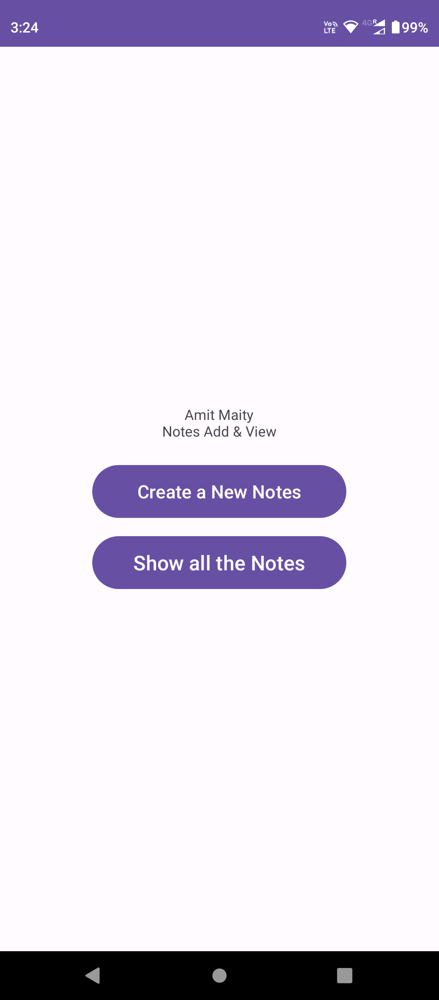
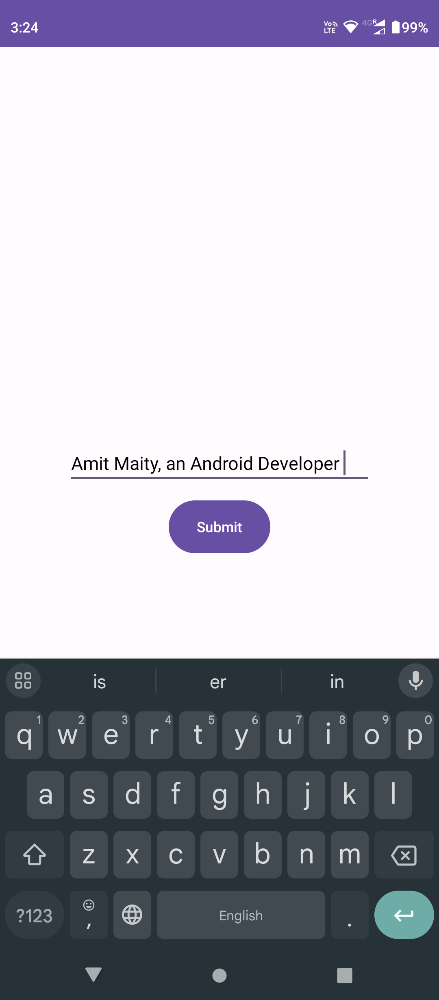
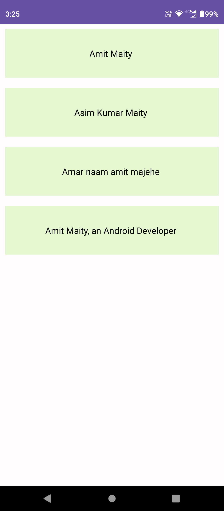

# Firebase-Notes---Kotlin-Android

I am practicing, Android in Kotlin.  
Created one Notes application in Android (Kotlin).  

## Features
1. You can add any Notes
2. You can View that added Notes.

||||
|:----------------------------------------:|:-----------------------------------------:|:-----------------------------------------: |
|  |  |  |
